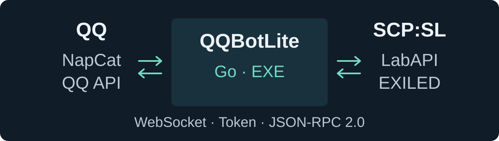

<h1 align="center">QQBotLite</h1>

<p align="center">在 QQ 中查询、管理 SCP:SL 服务器，让玩家求助及时到达管理员。</p>

<p align="center">
  <a href="LICENSE"></a>
  <a href="https://github.com/jikekei/QQBotLite/blob/main/bot/go.mod"></a>
  <a href="#快速开始"></a>
</p>

<p align="center">
  <a href="#快速开始">开始使用</a> ·
  <a href="#指令速查">指令速查</a> ·
  <a href="#权限与消息发送">权限设置</a> ·
  <a href="docs/plugins.md">插件安装</a> ·
  <a href="docs/development.md">源码编译</a>
</p>

**一个 Go EXE，配合每服一个 C# 插件。** QQ 接入选择 NapCat 或官方 API，服务端插件选择 LabAPI 或 EXILED。首次中文引导生成配置，之后启动自动读取；机器人运行无需安装开发语言环境或数据库。

```text
/cx

#1 1服
在线人数：3/25
在线管理：1人
总在线人数：3
```

上方为回复示例。多服按配置顺序分别显示，连接故障会显示“服务器未连接”。

## 快速开始

> **下载说明：** GitHub 当前提供源码，尚未上传预编译 Release。`Code → Download ZIP` 下载的是源码包，需要按下方说明编译。已有 `QQBotLite-win-x64.zip` 运行包时，可直接从第 1 步开始。

### 有运行包：三步接入

1. **配置机器人。** 解压后双击 `start.cmd`，填写接入方式、游戏端口、服务器名及 QQ 目标。完成引导后，自动保存 `config.json` 并生成各服的 `plugin-端口.yml`。
2. **安装一个插件。** 从 `plugins/LabAPI` 或 `plugins/EXILED` 选择对应 DLL。启动游戏服生成配置，再填入对应 YAML 中的 `bot_url`、`server_id`、`token`。[查看安装路径与完整示例 →](docs/plugins.md)
3. **完成第一次查询。** 重启游戏服，等待机器人日志显示游戏服“已就绪”，在 QQ 发送 `/cx`。官方群机器人按平台接收方式先 @ 机器人再输入指令。

| 要做的事 | 使用方式 |
| --- | --- |
| 日常启动 | 双击 `start.cmd`，自动读取已保存配置 |
| 修改设置 | 双击 `configure.cmd`，完成后保存并启动 |
| 检查配置 | 双击 `check-config.cmd`，检查后退出 |
| 保留 / 清空引导中的值 | 回车保留默认值；输入 `-` 清空可选项 |

配置引导中途退出，不会保存尚未完成的修改。每个游戏服只装一种 QQBotLite 插件。

### 只有源码：先编译

准备 Go 1.26+、.NET SDK 10、.NET Framework 4.8 Developer Pack、对应游戏服的 `Managed` 目录，以及 EXILED 9.14.2 的 `Exiled.API.dll`。

```powershell
git clone https://github.com/jikekei/QQBotLite.git
cd QQBotLite
.\build.ps1 -ScpslManaged 'D:\SCPSL\SCPSL_Data\Managed' -ExiledRefs 'D:\References\Exiled9142'
```

替换为本机实际引用目录。完成后解压 `dist/QQBotLite-win-x64.zip`，按上方三步配置。[完整构建说明 →](docs/development.md)

## 接入方式

<p align="center">
  
</p>

| 选择 | 已实现的支持 | 接入前准备 |
| --- | --- | --- |
| NapCat | OneBot 11 正向 WebSocket；消息段与 CQ 文本 | 登录 QQ，启用 NapCat WebSocket 服务端 |
| QQ 官方 API | WebSocket / Webhook、访问票据、事件验签 | AppID、AppSecret 与平台实际开通的能力；Webhook 需要公网 HTTPS |
| LabAPI | 针对 **1.1.7** 编译的独立 DLL | 对应版本游戏服 |
| EXILED | 针对 **9.14.2** 编译的独立 DLL | 对应版本加载器与游戏服 |

QQ 接入方式在配置中二选一；官方 API 的实际可用范围取决于平台授权。[NapCat / 官方 API 接入指南与排错 →](docs/qq-adapters.md)

## 指令速查

### 查询与日常使用

| 输入 | 返回内容 |
| --- | --- |
| `/cx` | 所有服务器人数、在线管理员与总人数 |
| `/info` | D 级人员、博士、SCP、回合时间、回合次数、下一波刷新倒计时 |
| `/列表`、`/＃` | 第 1 服玩家昵称与游戏内 ID |
| `/列表 2`、`/＃ 2` | 第 2 服玩家列表 |
| `/服务器状态`，或消息包含 `炸了？` / `炸了?` | 文字状态；可附带配置好的探针图片 |
| 消息包含 `helloworld` | `hello world！` |

### 管理指令

| 输入 | 操作 |
| --- | --- |
| `round list` | 玩家列表，按管理权限规则授权 |
| `round start` | 开启回合 |
| `round rest` | 重启当前回合 |
| `round allrest` | 重启选中的服务端进程 |
| `round kick+17` | 踢出玩家 ID 17，不封禁 |
| `round bc+公告内容` | 向选中的服务器广播 |

`/round` 与 `round` 等价。省略序号只操作第 1 服；例如 `round 2 kick+17` 对第 2 服执行踢出。序号由 `servers` 数组顺序决定，`allrest` 也只操作选中的服。

重启会先返回“已受理”，再调用游戏重启 API；恢复情况可用 `/cx` 查询。

### 游戏内求助

玩家输入 `.ac 求助内容`，插件提示在线管理员，并向配置的 QQ 目标提交通知。每名玩家间隔 **30 秒**，最多 **500 字**；插件 `enable_help: false` 可关闭求助功能。

当前精简范围保留上述指令。`/绑定`、`/击杀榜`、`/查询击杀信息` 及其数据库已移除；没有新增 QQ 指令。状态图片使用已有文件，截图与硬件监控服务不包含在此项目中。

## 权限与消息发送

### 谁可以管理服务器

| `administrator_ids` 设置 | `round` 授权规则 |
| --- | --- |
| 非空 | 只允许名单内的用户 |
| 空 | 允许当前群管理员与群主 |
| 空，且为私聊或未提供群身份 | 不授予管理权限；需要配置明确用户 ID |

NapCat 填写数字 QQ 号 / 群号；官方 API 填写实际事件中的用户 / 群 **OpenID**。日志显示会话 ID、用户 ID 与群身份，方便配置，不输出票据或聊天正文。官方身份取自 `author.member_role`，缺少时按未提供群身份处理，详情见接入指南。

### 消息发送遵守会话权限

- `allowed_groups` 为空时允许所有群；非空时仅处理列出的群，也仅向这些群推送求助。私聊不受群白名单影响。
- `alert_groups` / `alert_users` 为空时跳过对应 QQ 通知；游戏内管理提示仍可用。
- 平台拒绝、账号无权限、群不允许消息、连接断开或发送超时：**本次消息直接丢弃，不缓存、不重发、不换会话、不夹带到未来查询中。** 状态文字发送失败后也不再发送图片。

## 配置要点

首次引导为每服生成独立随机 Token；机器人与插件的 `server_id` 和 Token 必须一致。配置保存在程序目录，下一次启动直接读取。[字段示例 →](config.example.json)

| 设置 | 默认 / 用途 |
| --- | --- |
| `bridge_listen` | `127.0.0.1:17890`，机器人插件监听地址 |
| 插件 `bot_url` | `ws://127.0.0.1:17890/scpsl`，同机部署保持默认 |
| `servers` | 按数组顺序确定服务器序号 |
| `status_image` | 可选图片路径，相对 `config.json` 所在目录或绝对路径，最大 8 MiB |

`config.example.json` 是字段示例，请通过引导生成真实配置。配置修改后重启机器人；重新配置脚本完成后会自动启动。

<details>
<summary>远程部署与命令行选项</summary>

分机部署时将 `bridge_listen` 改为可达地址，插件 `bot_url` 指向机器人。公网使用 HTTPS 反代的 `wss://域名/scpsl`，保留 Authorization 头与 WebSocket 升级。

| 选项 | 行为 |
| --- | --- |
| `--setup` | 重新配置 |
| `--check` | 检查配置后退出 |
| `--headless` | 禁用交互引导与退出等待 |
| `--config 路径` | 指定配置文件 |

常驻运行可使用 `QQBotLite.exe --headless`。官方长文本按 UTF-8 边界拆分，受单事件回复次数限制；次数不足时跳过后续内容或图片，不改为主动消息补发。

</details>

不要公开 `config.json` 或生成的 `plugin-端口.yml`，其中包含票据。它们已从 Git 与分发包中排除。

## 文档

| 文档 | 内容 |
| --- | --- |
| [插件安装](docs/plugins.md) | LabAPI / EXILED 路径、YAML 与连接检查 |
| [QQ 接入](docs/qq-adapters.md) | NapCat、官方 WebSocket / Webhook 与常见问题 |
| [开发说明](docs/development.md) | 构建依赖与打包 |
| [桥接协议](docs/protocol.md) | WebSocket 鉴权、JSON-RPC、请求去重与超时 |

## 许可

采用 [MIT License](LICENSE)。第三方组件保留各自许可，详见 [第三方许可声明](THIRD_PARTY_NOTICES.txt)。
